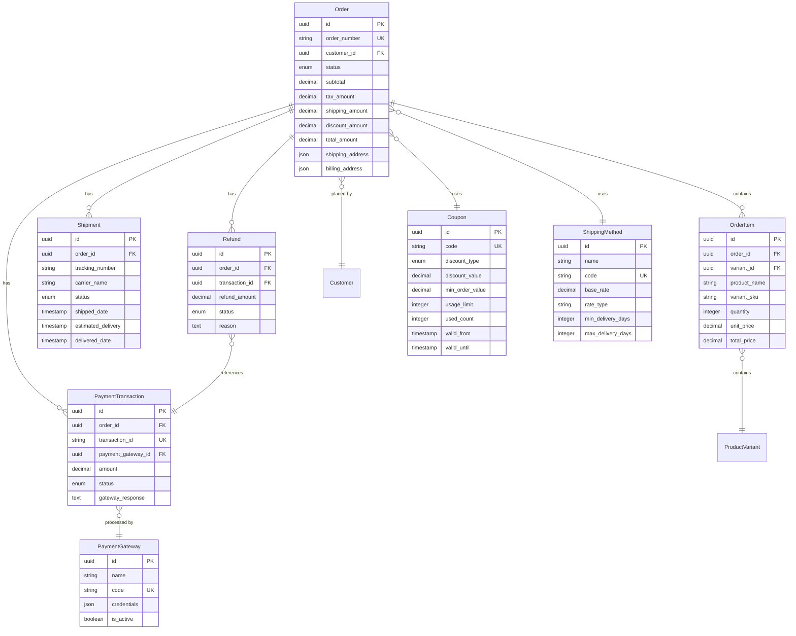
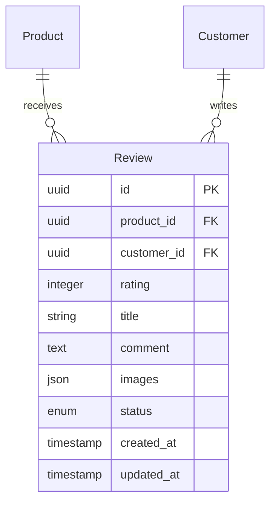

# Database Schema Documentation
## Online Readymade Store - Couture

---

## Overview

This document provides comprehensive database schema diagrams and table definitions for the Couture online readymade store platform.

---

## 1. Complete Entity Relationship Diagram

```mermaid
erDiagram
    Admin ||--o{ Order : manages
    Admin {
        uuid id PK
        string email UK
        string password_hash
        string name
        enum role
        boolean is_active
        timestamp created_at
        timestamp updated_at
    }

    Customer ||--o{ CustomerAddress : has
    Customer ||--o{ Order : places
    Customer ||--o{ Wishlist : has
    Customer ||--o{ Cart : has
    Customer ||--o{ Review : writes
    Customer {
        uuid id PK
        string email UK
        string password_hash
        string first_name
        string last_name
        string phone
        string avatar_url
        boolean email_verified
        timestamp created_at
        timestamp updated_at
    }

    CustomerAddress {
        uuid id PK
        uuid customer_id FK
        string address_type
        string full_name
        string phone
        string address_line1
        string address_line2
        string city
        string state
        string postal_code
        string country
        boolean is_default_shipping
        boolean is_default_billing
        timestamp created_at
        timestamp updated_at
    }

    Category ||--o{ Category : "parent-child"
    Category ||--o{ Product : contains
    Category {
        uuid id PK
        uuid parent_id FK
        string name
        string slug UK
        text description
        string image_url
        integer sort_order
        boolean is_active
        timestamp created_at
        timestamp updated_at
    }

    Brand ||--o{ Product : has
    Brand {
        uuid id PK
        string name
        string slug UK
        text description
        string logo_url
        boolean is_active
        timestamp created_at
        timestamp updated_at
    }

    Product ||--o{ ProductVariant : has
    Product ||--o{ Review : receives
    Product ||--o{ Wishlist : "in"
    Product }o--|| Category : "belongs to"
    Product }o--|| Brand : "belongs to"
    Product {
        uuid id PK
        uuid category_id FK
        uuid brand_id FK
        string name
        string slug UK
        text description
        decimal base_price
        decimal sale_price
        string featured_image
        boolean is_active
        boolean is_featured
        boolean is_new_arrival
        integer view_count
        timestamp created_at
        timestamp updated_at
    }

    ProductVariant ||--|| Inventory : has
    ProductVariant ||--o{ CartItem : "in"
    ProductVariant ||--o{ OrderItem : "in"
    ProductVariant {
        uuid id PK
        uuid product_id FK
        string sku UK
        uuid size_id FK
        uuid color_id FK
        decimal variant_price
        string variant_image
        boolean is_active
        timestamp created_at
        timestamp updated_at
    }

    Size ||--o{ ProductVariant : defines
    Size {
        uuid id PK
        string name
        string code
        string size_group
        integer sort_order
        timestamp created_at
    }

    Color ||--o{ ProductVariant : defines
    Color {
        uuid id PK
        string name
        string hex_code
        string rgb_code
        timestamp created_at
    }

    Inventory {
        uuid id PK
        uuid variant_id FK UK
        integer quantity
        integer reserved_quantity
        integer low_stock_threshold
        timestamp last_updated
    }

    ProductImage {
        uuid id PK
        uuid product_id FK
        string image_url
        integer sort_order
        timestamp created_at
    }

    Product ||--o{ ProductImage : has

    Cart ||--o{ CartItem : contains
    Cart {
        uuid id PK
        uuid customer_id FK UK
        timestamp expires_at
        timestamp created_at
        timestamp updated_at
    }

    CartItem {
        uuid id PK
        uuid cart_id FK
        uuid variant_id FK
        integer quantity
        timestamp added_at
    }

    Wishlist {
        uuid id PK
        uuid customer_id FK
        uuid product_id FK
        timestamp added_at
    }

    Order ||--o{ OrderItem : contains
    Order ||--o{ PaymentTransaction : has
    Order ||--o{ Shipment : has
    Order ||--o{ Refund : has
    Order }o--|| Customer : "placed by"
    Order }o--|| Coupon : uses
    Order }o--|| ShippingMethod : uses
    Order {
        uuid id PK
        string order_number UK
        uuid customer_id FK
        enum status
        decimal subtotal
        decimal tax_amount
        decimal shipping_amount
        decimal discount_amount
        decimal total_amount
        uuid coupon_id FK
        uuid shipping_method_id FK
        json shipping_address
        json billing_address
        text customer_notes
        timestamp order_date
        timestamp created_at
        timestamp updated_at
    }

    OrderItem {
        uuid id PK
        uuid order_id FK
        uuid variant_id FK
        string product_name
        string variant_sku
        integer quantity
        decimal unit_price
        decimal total_price
        timestamp created_at
    }

    PaymentTransaction {
        uuid id PK
        uuid order_id FK
        string transaction_id UK
        uuid payment_gateway_id FK
        decimal amount
        enum status
        text gateway_response
        timestamp payment_date
        timestamp created_at
    }

    PaymentGateway ||--o{ PaymentTransaction : processes
    PaymentGateway {
        uuid id PK
        string name
        string code UK
        json credentials
        boolean is_active
        timestamp created_at
        timestamp updated_at
    }

    Shipment {
        uuid id PK
        uuid order_id FK
        string tracking_number
        string carrier_name
        enum status
        timestamp shipped_date
        timestamp estimated_delivery
        timestamp delivered_date
        timestamp created_at
        timestamp updated_at
    }

    ShippingMethod {
        uuid id PK
        string name
        string code UK
        decimal base_rate
        string rate_type
        integer min_delivery_days
        integer max_delivery_days
        boolean is_active
        timestamp created_at
    }

    Refund {
        uuid id PK
        uuid order_id FK
        uuid transaction_id FK
        decimal refund_amount
        enum status
        text reason
        text admin_notes
        timestamp requested_date
        timestamp processed_date
        timestamp created_at
    }

    Coupon {
        uuid id PK
        string code UK
        enum discount_type
        decimal discount_value
        decimal min_order_value
        integer usage_limit
        integer used_count
        timestamp valid_from
        timestamp valid_until
        boolean is_active
        timestamp created_at
        timestamp updated_at
    }

    Review {
        uuid id PK
        uuid product_id FK
        uuid customer_id FK
        integer rating
        string title
        text comment
        json images
        enum status
        timestamp created_at
        timestamp updated_at
    }

    Tax {
        uuid id PK
        string name
        string region
        decimal rate
        boolean is_active
        timestamp created_at
        timestamp updated_at
    }

    Newsletter {
        uuid id PK
        string email UK
        boolean is_subscribed
        timestamp subscribed_at
        timestamp unsubscribed_at
    }

    Banner {
        uuid id PK
        string title
        text description
        string image_url
        string link_url
        integer sort_order
        boolean is_active
        timestamp start_date
        timestamp end_date
        timestamp created_at
        timestamp updated_at
    }

    SEOMetadata {
        uuid id PK
        string entity_type
        uuid entity_id
        string meta_title
        text meta_description
        text meta_keywords
        text og_title
        text og_description
        string og_image
        timestamp created_at
        timestamp updated_at
    }

    StoreSettings {
        uuid id PK
        string key UK
        text value
        string data_type
        timestamp updated_at
    }

    AuditLog {
        uuid id PK
        uuid admin_id FK
        string action
        string entity_type
        uuid entity_id
        json old_values
        json new_values
        string ip_address
        timestamp created_at
    }

    Admin ||--o{ AuditLog : performs
```

---

## 2. Functional Area Diagrams

### 2.1 Product Management Schema

```mermaid
erDiagram
    Category ||--o{ Category : "parent-child"
    Category ||--o{ Product : contains
    Category {
        uuid id PK
        uuid parent_id FK
        string name
        string slug UK
        text description
        string image_url
        integer sort_order
        boolean is_active
    }

    Brand ||--o{ Product : has
    Brand {
        uuid id PK
        string name
        string slug UK
        text description
        string logo_url
        boolean is_active
    }

    Product ||--o{ ProductVariant : has
    Product ||--o{ ProductImage : has
    Product {
        uuid id PK
        uuid category_id FK
        uuid brand_id FK
        string name
        string slug UK
        text description
        decimal base_price
        decimal sale_price
        string featured_image
        boolean is_active
        boolean is_featured
        boolean is_new_arrival
    }

    ProductVariant ||--|| Inventory : has
    ProductVariant }o--|| Size : uses
    ProductVariant }o--|| Color : uses
    ProductVariant {
        uuid id PK
        uuid product_id FK
        string sku UK
        uuid size_id FK
        uuid color_id FK
        decimal variant_price
        string variant_image
    }

    Size {
        uuid id PK
        string name
        string code
        string size_group
    }

    Color {
        uuid id PK
        string name
        string hex_code
    }

    Inventory {
        uuid id PK
        uuid variant_id FK UK
        integer quantity
        integer reserved_quantity
        integer low_stock_threshold
    }

    ProductImage {
        uuid id PK
        uuid product_id FK
        string image_url
        integer sort_order
    }
```

### 2.2 Customer & Authentication Schema

```mermaid
erDiagram
    Customer ||--o{ CustomerAddress : has
    Customer ||--o{ Cart : has
    Customer ||--o{ Wishlist : has
    Customer {
        uuid id PK
        string email UK
        string password_hash
        string first_name
        string last_name
        string phone
        string avatar_url
        boolean email_verified
        timestamp created_at
    }

    CustomerAddress {
        uuid id PK
        uuid customer_id FK
        string address_type
        string full_name
        string phone
        string address_line1
        string address_line2
        string city
        string state
        string postal_code
        string country
        boolean is_default_shipping
        boolean is_default_billing
    }

    Cart ||--o{ CartItem : contains
    Cart {
        uuid id PK
        uuid customer_id FK UK
        timestamp expires_at
    }

    CartItem }o--|| ProductVariant : contains
    CartItem {
        uuid id PK
        uuid cart_id FK
        uuid variant_id FK
        integer quantity
    }

    Wishlist }o--|| Product : contains
    Wishlist {
        uuid id PK
        uuid customer_id FK
        uuid product_id FK
        timestamp added_at
    }
```

### 2.3 Order & Payment Schema



### 2.4 Review & Rating Schema



---

## 3. Detailed Table Definitions

### 3.1 Admin Table
```sql
CREATE TABLE admins (
    id UUID PRIMARY KEY DEFAULT gen_random_uuid(),
    email VARCHAR(255) UNIQUE NOT NULL,
    password_hash VARCHAR(255) NOT NULL,
    name VARCHAR(255) NOT NULL,
    role VARCHAR(50) NOT NULL DEFAULT 'admin', -- 'super_admin', 'admin', 'staff'
    is_active BOOLEAN DEFAULT true,
    created_at TIMESTAMP DEFAULT CURRENT_TIMESTAMP,
    updated_at TIMESTAMP DEFAULT CURRENT_TIMESTAMP
);

CREATE INDEX idx_admins_email ON admins(email);
CREATE INDEX idx_admins_role ON admins(role);
```

### 3.2 Customer Table
```sql
CREATE TABLE customers (
    id UUID PRIMARY KEY DEFAULT gen_random_uuid(),
    email VARCHAR(255) UNIQUE NOT NULL,
    password_hash VARCHAR(255) NOT NULL,
    first_name VARCHAR(100) NOT NULL,
    last_name VARCHAR(100) NOT NULL,
    phone VARCHAR(20),
    avatar_url TEXT,
    email_verified BOOLEAN DEFAULT false,
    oauth_provider VARCHAR(50), -- 'google', 'facebook', null
    oauth_provider_id VARCHAR(255),
    created_at TIMESTAMP DEFAULT CURRENT_TIMESTAMP,
    updated_at TIMESTAMP DEFAULT CURRENT_TIMESTAMP
);

CREATE INDEX idx_customers_email ON customers(email);
CREATE INDEX idx_customers_created_at ON customers(created_at);
CREATE INDEX idx_customers_oauth ON customers(oauth_provider, oauth_provider_id);
```

### 3.3 Customer Address Table
```sql
CREATE TABLE customer_addresses (
    id UUID PRIMARY KEY DEFAULT gen_random_uuid(),
    customer_id UUID NOT NULL REFERENCES customers(id) ON DELETE CASCADE,
    address_type VARCHAR(20) DEFAULT 'shipping', -- 'shipping', 'billing', 'both'
    full_name VARCHAR(255) NOT NULL,
    phone VARCHAR(20) NOT NULL,
    address_line1 VARCHAR(255) NOT NULL,
    address_line2 VARCHAR(255),
    city VARCHAR(100) NOT NULL,
    state VARCHAR(100) NOT NULL,
    postal_code VARCHAR(20) NOT NULL,
    country VARCHAR(100) NOT NULL DEFAULT 'India',
    is_default_shipping BOOLEAN DEFAULT false,
    is_default_billing BOOLEAN DEFAULT false,
    created_at TIMESTAMP DEFAULT CURRENT_TIMESTAMP,
    updated_at TIMESTAMP DEFAULT CURRENT_TIMESTAMP
);

CREATE INDEX idx_customer_addresses_customer ON customer_addresses(customer_id);
CREATE INDEX idx_customer_addresses_default_shipping ON customer_addresses(customer_id, is_default_shipping);
```

### 3.4 Category Table
```sql
CREATE TABLE categories (
    id UUID PRIMARY KEY DEFAULT gen_random_uuid(),
    parent_id UUID REFERENCES categories(id) ON DELETE SET NULL,
    name VARCHAR(255) NOT NULL,
    slug VARCHAR(255) UNIQUE NOT NULL,
    description TEXT,
    image_url TEXT,
    sort_order INTEGER DEFAULT 0,
    is_active BOOLEAN DEFAULT true,
    created_at TIMESTAMP DEFAULT CURRENT_TIMESTAMP,
    updated_at TIMESTAMP DEFAULT CURRENT_TIMESTAMP
);

CREATE INDEX idx_categories_parent ON categories(parent_id);
CREATE INDEX idx_categories_slug ON categories(slug);
CREATE INDEX idx_categories_active ON categories(is_active);
CREATE INDEX idx_categories_sort ON categories(sort_order);
```

### 3.5 Brand Table
```sql
CREATE TABLE brands (
    id UUID PRIMARY KEY DEFAULT gen_random_uuid(),
    name VARCHAR(255) NOT NULL,
    slug VARCHAR(255) UNIQUE NOT NULL,
    description TEXT,
    logo_url TEXT,
    is_active BOOLEAN DEFAULT true,
    created_at TIMESTAMP DEFAULT CURRENT_TIMESTAMP,
    updated_at TIMESTAMP DEFAULT CURRENT_TIMESTAMP
);

CREATE INDEX idx_brands_slug ON brands(slug);
CREATE INDEX idx_brands_active ON brands(is_active);
```

### 3.6 Size Table
```sql
CREATE TABLE sizes (
    id UUID PRIMARY KEY DEFAULT gen_random_uuid(),
    name VARCHAR(50) NOT NULL,
    code VARCHAR(20) NOT NULL,
    size_group VARCHAR(50), -- 'clothing', 'shoes', 'accessories'
    sort_order INTEGER DEFAULT 0,
    created_at TIMESTAMP DEFAULT CURRENT_TIMESTAMP
);

CREATE INDEX idx_sizes_group ON sizes(size_group);
CREATE INDEX idx_sizes_sort ON sizes(sort_order);
```

### 3.7 Color Table
```sql
CREATE TABLE colors (
    id UUID PRIMARY KEY DEFAULT gen_random_uuid(),
    name VARCHAR(50) NOT NULL,
    hex_code VARCHAR(7) NOT NULL,
    rgb_code VARCHAR(20),
    created_at TIMESTAMP DEFAULT CURRENT_TIMESTAMP
);

CREATE INDEX idx_colors_name ON colors(name);
```

### 3.8 Product Table
```sql
CREATE TABLE products (
    id UUID PRIMARY KEY DEFAULT gen_random_uuid(),
    category_id UUID NOT NULL REFERENCES categories(id) ON DELETE RESTRICT,
    brand_id UUID REFERENCES brands(id) ON DELETE SET NULL,
    name VARCHAR(255) NOT NULL,
    slug VARCHAR(255) UNIQUE NOT NULL,
    description TEXT,
    base_price DECIMAL(10, 2) NOT NULL,
    sale_price DECIMAL(10, 2),
    featured_image TEXT,
    is_active BOOLEAN DEFAULT true,
    is_featured BOOLEAN DEFAULT false,
    is_new_arrival BOOLEAN DEFAULT false,
    view_count INTEGER DEFAULT 0,
    created_at TIMESTAMP DEFAULT CURRENT_TIMESTAMP,
    updated_at TIMESTAMP DEFAULT CURRENT_TIMESTAMP
);

CREATE INDEX idx_products_category ON products(category_id);
CREATE INDEX idx_products_brand ON products(brand_id);
CREATE INDEX idx_products_slug ON products(slug);
CREATE INDEX idx_products_active ON products(is_active);
CREATE INDEX idx_products_featured ON products(is_featured);
CREATE INDEX idx_products_new_arrival ON products(is_new_arrival);
CREATE INDEX idx_products_created ON products(created_at DESC);
```

### 3.9 Product Variant Table
```sql
CREATE TABLE product_variants (
    id UUID PRIMARY KEY DEFAULT gen_random_uuid(),
    product_id UUID NOT NULL REFERENCES products(id) ON DELETE CASCADE,
    sku VARCHAR(100) UNIQUE NOT NULL,
    size_id UUID REFERENCES sizes(id) ON DELETE RESTRICT,
    color_id UUID REFERENCES colors(id) ON DELETE RESTRICT,
    variant_price DECIMAL(10, 2),
    variant_image TEXT,
    is_active BOOLEAN DEFAULT true,
    created_at TIMESTAMP DEFAULT CURRENT_TIMESTAMP,
    updated_at TIMESTAMP DEFAULT CURRENT_TIMESTAMP,
    UNIQUE(product_id, size_id, color_id)
);

CREATE INDEX idx_product_variants_product ON product_variants(product_id);
CREATE INDEX idx_product_variants_sku ON product_variants(sku);
CREATE INDEX idx_product_variants_size ON product_variants(size_id);
CREATE INDEX idx_product_variants_color ON product_variants(color_id);
```

### 3.10 Inventory Table
```sql
CREATE TABLE inventory (
    id UUID PRIMARY KEY DEFAULT gen_random_uuid(),
    variant_id UUID UNIQUE NOT NULL REFERENCES product_variants(id) ON DELETE CASCADE,
    quantity INTEGER NOT NULL DEFAULT 0,
    reserved_quantity INTEGER NOT NULL DEFAULT 0,
    low_stock_threshold INTEGER DEFAULT 10,
    last_updated TIMESTAMP DEFAULT CURRENT_TIMESTAMP
);

CREATE INDEX idx_inventory_variant ON inventory(variant_id);
CREATE INDEX idx_inventory_low_stock ON inventory(quantity) WHERE quantity <= low_stock_threshold;
```

### 3.11 Product Image Table
```sql
CREATE TABLE product_images (
    id UUID PRIMARY KEY DEFAULT gen_random_uuid(),
    product_id UUID NOT NULL REFERENCES products(id) ON DELETE CASCADE,
    image_url TEXT NOT NULL,
    sort_order INTEGER DEFAULT 0,
    created_at TIMESTAMP DEFAULT CURRENT_TIMESTAMP
);

CREATE INDEX idx_product_images_product ON product_images(product_id);
CREATE INDEX idx_product_images_sort ON product_images(product_id, sort_order);
```

### 3.12 Cart Table
```sql
CREATE TABLE carts (
    id UUID PRIMARY KEY DEFAULT gen_random_uuid(),
    customer_id UUID UNIQUE NOT NULL REFERENCES customers(id) ON DELETE CASCADE,
    expires_at TIMESTAMP,
    created_at TIMESTAMP DEFAULT CURRENT_TIMESTAMP,
    updated_at TIMESTAMP DEFAULT CURRENT_TIMESTAMP
);

CREATE INDEX idx_carts_customer ON carts(customer_id);
CREATE INDEX idx_carts_expires ON carts(expires_at);
```

### 3.13 Cart Item Table
```sql
CREATE TABLE cart_items (
    id UUID PRIMARY KEY DEFAULT gen_random_uuid(),
    cart_id UUID NOT NULL REFERENCES carts(id) ON DELETE CASCADE,
    variant_id UUID NOT NULL REFERENCES product_variants(id) ON DELETE CASCADE,
    quantity INTEGER NOT NULL DEFAULT 1,
    added_at TIMESTAMP DEFAULT CURRENT_TIMESTAMP,
    UNIQUE(cart_id, variant_id)
);

CREATE INDEX idx_cart_items_cart ON cart_items(cart_id);
CREATE INDEX idx_cart_items_variant ON cart_items(variant_id);
```

### 3.14 Wishlist Table
```sql
CREATE TABLE wishlists (
    id UUID PRIMARY KEY DEFAULT gen_random_uuid(),
    customer_id UUID NOT NULL REFERENCES customers(id) ON DELETE CASCADE,
    product_id UUID NOT NULL REFERENCES products(id) ON DELETE CASCADE,
    added_at TIMESTAMP DEFAULT CURRENT_TIMESTAMP,
    UNIQUE(customer_id, product_id)
);

CREATE INDEX idx_wishlists_customer ON wishlists(customer_id);
CREATE INDEX idx_wishlists_product ON wishlists(product_id);
```

### 3.15 Coupon Table
```sql
CREATE TABLE coupons (
    id UUID PRIMARY KEY DEFAULT gen_random_uuid(),
    code VARCHAR(50) UNIQUE NOT NULL,
    discount_type VARCHAR(20) NOT NULL, -- 'percentage', 'fixed', 'bogo'
    discount_value DECIMAL(10, 2) NOT NULL,
    min_order_value DECIMAL(10, 2) DEFAULT 0,
    usage_limit INTEGER,
    used_count INTEGER DEFAULT 0,
    valid_from TIMESTAMP,
    valid_until TIMESTAMP,
    is_active BOOLEAN DEFAULT true,
    created_at TIMESTAMP DEFAULT CURRENT_TIMESTAMP,
    updated_at TIMESTAMP DEFAULT CURRENT_TIMESTAMP
);

CREATE INDEX idx_coupons_code ON coupons(code);
CREATE INDEX idx_coupons_active ON coupons(is_active);
CREATE INDEX idx_coupons_validity ON coupons(valid_from, valid_until);
```

### 3.16 Shipping Method Table
```sql
CREATE TABLE shipping_methods (
    id UUID PRIMARY KEY DEFAULT gen_random_uuid(),
    name VARCHAR(255) NOT NULL,
    code VARCHAR(50) UNIQUE NOT NULL,
    base_rate DECIMAL(10, 2) NOT NULL,
    rate_type VARCHAR(20) DEFAULT 'flat', -- 'flat', 'weight_based', 'price_based'
    min_delivery_days INTEGER,
    max_delivery_days INTEGER,
    is_active BOOLEAN DEFAULT true,
    created_at TIMESTAMP DEFAULT CURRENT_TIMESTAMP,
    updated_at TIMESTAMP DEFAULT CURRENT_TIMESTAMP
);

CREATE INDEX idx_shipping_methods_code ON shipping_methods(code);
CREATE INDEX idx_shipping_methods_active ON shipping_methods(is_active);
```

### 3.17 Payment Gateway Table
```sql
CREATE TABLE payment_gateways (
    id UUID PRIMARY KEY DEFAULT gen_random_uuid(),
    name VARCHAR(255) NOT NULL,
    code VARCHAR(50) UNIQUE NOT NULL, -- 'razorpay', 'stripe', 'cod'
    credentials JSONB, -- encrypted gateway credentials
    is_active BOOLEAN DEFAULT true,
    created_at TIMESTAMP DEFAULT CURRENT_TIMESTAMP,
    updated_at TIMESTAMP DEFAULT CURRENT_TIMESTAMP
);

CREATE INDEX idx_payment_gateways_code ON payment_gateways(code);
CREATE INDEX idx_payment_gateways_active ON payment_gateways(is_active);
```

### 3.18 Order Table
```sql
CREATE TABLE orders (
    id UUID PRIMARY KEY DEFAULT gen_random_uuid(),
    order_number VARCHAR(50) UNIQUE NOT NULL,
    customer_id UUID NOT NULL REFERENCES customers(id) ON DELETE RESTRICT,
    status VARCHAR(50) NOT NULL DEFAULT 'pending', 
    -- 'pending', 'processing', 'confirmed', 'shipped', 'delivered', 'cancelled', 'refunded'
    subtotal DECIMAL(10, 2) NOT NULL,
    tax_amount DECIMAL(10, 2) DEFAULT 0,
    shipping_amount DECIMAL(10, 2) DEFAULT 0,
    discount_amount DECIMAL(10, 2) DEFAULT 0,
    total_amount DECIMAL(10, 2) NOT NULL,
    coupon_id UUID REFERENCES coupons(id) ON DELETE SET NULL,
    shipping_method_id UUID REFERENCES shipping_methods(id) ON DELETE SET NULL,
    shipping_address JSONB NOT NULL,
    billing_address JSONB NOT NULL,
    customer_notes TEXT,
    order_date TIMESTAMP DEFAULT CURRENT_TIMESTAMP,
    created_at TIMESTAMP DEFAULT CURRENT_TIMESTAMP,
    updated_at TIMESTAMP DEFAULT CURRENT_TIMESTAMP
);

CREATE INDEX idx_orders_number ON orders(order_number);
CREATE INDEX idx_orders_customer ON orders(customer_id);
CREATE INDEX idx_orders_status ON orders(status);
CREATE INDEX idx_orders_date ON orders(order_date DESC);
CREATE INDEX idx_orders_customer_status ON orders(customer_id, status);
```

### 3.19 Order Item Table
```sql
CREATE TABLE order_items (
    id UUID PRIMARY KEY DEFAULT gen_random_uuid(),
    order_id UUID NOT NULL REFERENCES orders(id) ON DELETE CASCADE,
    variant_id UUID NOT NULL REFERENCES product_variants(id) ON DELETE RESTRICT,
    product_name VARCHAR(255) NOT NULL,
    variant_sku VARCHAR(100) NOT NULL,
    quantity INTEGER NOT NULL,
    unit_price DECIMAL(10, 2) NOT NULL,
    total_price DECIMAL(10, 2) NOT NULL,
    created_at TIMESTAMP DEFAULT CURRENT_TIMESTAMP
);

CREATE INDEX idx_order_items_order ON order_items(order_id);
CREATE INDEX idx_order_items_variant ON order_items(variant_id);
```

### 3.20 Payment Transaction Table
```sql
CREATE TABLE payment_transactions (
    id UUID PRIMARY KEY DEFAULT gen_random_uuid(),
    order_id UUID NOT NULL REFERENCES orders(id) ON DELETE RESTRICT,
    transaction_id VARCHAR(255) UNIQUE NOT NULL,
    payment_gateway_id UUID NOT NULL REFERENCES payment_gateways(id) ON DELETE RESTRICT,
    amount DECIMAL(10, 2) NOT NULL,
    status VARCHAR(50) NOT NULL, -- 'pending', 'completed', 'failed', 'refunded'
    gateway_response JSONB,
    payment_date TIMESTAMP,
    created_at TIMESTAMP DEFAULT CURRENT_TIMESTAMP
);

CREATE INDEX idx_payment_transactions_order ON payment_transactions(order_id);
CREATE INDEX idx_payment_transactions_id ON payment_transactions(transaction_id);
CREATE INDEX idx_payment_transactions_status ON payment_transactions(status);
```

### 3.21 Shipment Table
```sql
CREATE TABLE shipments (
    id UUID PRIMARY KEY DEFAULT gen_random_uuid(),
    order_id UUID NOT NULL REFERENCES orders(id) ON DELETE CASCADE,
    tracking_number VARCHAR(255),
    carrier_name VARCHAR(255),
    status VARCHAR(50) DEFAULT 'preparing', 
    -- 'preparing', 'shipped', 'in_transit', 'out_for_delivery', 'delivered', 'failed'
    shipped_date TIMESTAMP,
    estimated_delivery TIMESTAMP,
    delivered_date TIMESTAMP,
    created_at TIMESTAMP DEFAULT CURRENT_TIMESTAMP,
    updated_at TIMESTAMP DEFAULT CURRENT_TIMESTAMP
);

CREATE INDEX idx_shipments_order ON shipments(order_id);
CREATE INDEX idx_shipments_tracking ON shipments(tracking_number);
CREATE INDEX idx_shipments_status ON shipments(status);
```

### 3.22 Refund Table
```sql
CREATE TABLE refunds (
    id UUID PRIMARY KEY DEFAULT gen_random_uuid(),
    order_id UUID NOT NULL REFERENCES orders(id) ON DELETE RESTRICT,
    transaction_id UUID REFERENCES payment_transactions(id) ON DELETE RESTRICT,
    refund_amount DECIMAL(10, 2) NOT NULL,
    status VARCHAR(50) DEFAULT 'requested', -- 'requested', 'approved', 'processing', 'completed', 'rejected'
    reason TEXT,
    admin_notes TEXT,
    requested_date TIMESTAMP DEFAULT CURRENT_TIMESTAMP,
    processed_date TIMESTAMP,
    created_at TIMESTAMP DEFAULT CURRENT_TIMESTAMP
);

CREATE INDEX idx_refunds_order ON refunds(order_id);
CREATE INDEX idx_refunds_status ON refunds(status);
```

### 3.23 Review Table
```sql
CREATE TABLE reviews (
    id UUID PRIMARY KEY DEFAULT gen_random_uuid(),
    product_id UUID NOT NULL REFERENCES products(id) ON DELETE CASCADE,
    customer_id UUID NOT NULL REFERENCES customers(id) ON DELETE CASCADE,
    rating INTEGER NOT NULL CHECK (rating >= 1 AND rating <= 5),
    title VARCHAR(255),
    comment TEXT,
    images JSONB, -- array of image URLs
    status VARCHAR(50) DEFAULT 'pending', -- 'pending', 'approved', 'rejected'
    created_at TIMESTAMP DEFAULT CURRENT_TIMESTAMP,
    updated_at TIMESTAMP DEFAULT CURRENT_TIMESTAMP,
    UNIQUE(product_id, customer_id)
);

CREATE INDEX idx_reviews_product ON reviews(product_id);
CREATE INDEX idx_reviews_customer ON reviews(customer_id);
CREATE INDEX idx_reviews_status ON reviews(status);
CREATE INDEX idx_reviews_rating ON reviews(rating);
```

### 3.24 Tax Table
```sql
CREATE TABLE taxes (
    id UUID PRIMARY KEY DEFAULT gen_random_uuid(),
    name VARCHAR(255) NOT NULL,
    region VARCHAR(255), -- state/country
    rate DECIMAL(5, 2) NOT NULL, -- percentage
    is_active BOOLEAN DEFAULT true,
    created_at TIMESTAMP DEFAULT CURRENT_TIMESTAMP,
    updated_at TIMESTAMP DEFAULT CURRENT_TIMESTAMP
);

CREATE INDEX idx_taxes_region ON taxes(region);
CREATE INDEX idx_taxes_active ON taxes(is_active);
```

### 3.25 Newsletter Table
```sql
CREATE TABLE newsletters (
    id UUID PRIMARY KEY DEFAULT gen_random_uuid(),
    email VARCHAR(255) UNIQUE NOT NULL,
    is_subscribed BOOLEAN DEFAULT true,
    subscribed_at TIMESTAMP DEFAULT CURRENT_TIMESTAMP,
    unsubscribed_at TIMESTAMP
);

CREATE INDEX idx_newsletters_email ON newsletters(email);
CREATE INDEX idx_newsletters_subscribed ON newsletters(is_subscribed);
```

### 3.26 Banner Table
```sql
CREATE TABLE banners (
    id UUID PRIMARY KEY DEFAULT gen_random_uuid(),
    title VARCHAR(255) NOT NULL,
    description TEXT,
    image_url TEXT NOT NULL,
    link_url TEXT,
    sort_order INTEGER DEFAULT 0,
    is_active BOOLEAN DEFAULT true,
    start_date TIMESTAMP,
    end_date TIMESTAMP,
    created_at TIMESTAMP DEFAULT CURRENT_TIMESTAMP,
    updated_at TIMESTAMP DEFAULT CURRENT_TIMESTAMP
);

CREATE INDEX idx_banners_active ON banners(is_active);
CREATE INDEX idx_banners_sort ON banners(sort_order);
CREATE INDEX idx_banners_dates ON banners(start_date, end_date);
```

### 3.27 SEO Metadata Table
```sql
CREATE TABLE seo_metadata (
    id UUID PRIMARY KEY DEFAULT gen_random_uuid(),
    entity_type VARCHAR(50) NOT NULL, -- 'product', 'category', 'brand', 'page'
    entity_id UUID NOT NULL,
    meta_title VARCHAR(255),
    meta_description TEXT,
    meta_keywords TEXT,
    og_title VARCHAR(255),
    og_description TEXT,
    og_image TEXT,
    created_at TIMESTAMP DEFAULT CURRENT_TIMESTAMP,
    updated_at TIMESTAMP DEFAULT CURRENT_TIMESTAMP,
    UNIQUE(entity_type, entity_id)
);

CREATE INDEX idx_seo_metadata_entity ON seo_metadata(entity_type, entity_id);
```

### 3.28 Store Settings Table
```sql
CREATE TABLE store_settings (
    id UUID PRIMARY KEY DEFAULT gen_random_uuid(),
    key VARCHAR(255) UNIQUE NOT NULL,
    value TEXT,
    data_type VARCHAR(50) DEFAULT 'string', -- 'string', 'number', 'boolean', 'json'
    updated_at TIMESTAMP DEFAULT CURRENT_TIMESTAMP
);

CREATE INDEX idx_store_settings_key ON store_settings(key);
```

### 3.29 Audit Log Table
```sql
CREATE TABLE audit_logs (
    id UUID PRIMARY KEY DEFAULT gen_random_uuid(),
    admin_id UUID REFERENCES admins(id) ON DELETE SET NULL,
    action VARCHAR(100) NOT NULL, -- 'create', 'update', 'delete'
    entity_type VARCHAR(50) NOT NULL,
    entity_id UUID NOT NULL,
    old_values JSONB,
    new_values JSONB,
    ip_address VARCHAR(45),
    created_at TIMESTAMP DEFAULT CURRENT_TIMESTAMP
);

CREATE INDEX idx_audit_logs_admin ON audit_logs(admin_id);
CREATE INDEX idx_audit_logs_entity ON audit_logs(entity_type, entity_id);
CREATE INDEX idx_audit_logs_created ON audit_logs(created_at DESC);
```

---

## 4. Indexes Summary

### High Priority Indexes
- **Products**: category_id, brand_id, slug, is_active, created_at
- **Orders**: customer_id, status, order_date, order_number
- **Customers**: email, created_at
- **ProductVariants**: product_id, sku
- **Inventory**: variant_id, low stock threshold
- **Reviews**: product_id, status

### Composite Indexes
- `orders(customer_id, status)` - Customer order history filtering
- `product_images(product_id, sort_order)` - Image gallery retrieval
- `customer_addresses(customer_id, is_default_shipping)` - Default address lookup

---

## 5. Data Types & Constraints

### UUID vs Integer IDs
- **Using UUID** for all primary keys for:
  - Better security (non-sequential)
  - Distributed system compatibility
  - Merge-friendly across databases

### Price Storage
- **DECIMAL(10, 2)** for all monetary values
- Stores up to 99,999,999.99
- Prevents floating-point precision issues

### JSONB Usage
- Shipping/billing addresses (flexible structure)
- Payment gateway responses
- SEO metadata
- Product review images

### Timestamps
- All tables have `created_at`
- Modified tables have `updated_at`
- Trigger-based auto-update for `updated_at`

---

## 6. Foreign Key Relationships

### Cascade Delete
- `cart_items` → `carts` (ON DELETE CASCADE)
- `order_items` → `orders` (ON DELETE CASCADE)
- `product_variants` → `products` (ON DELETE CASCADE)

### Restrict Delete
- `products` → `categories` (ON DELETE RESTRICT)
- `orders` → `customers` (ON DELETE RESTRICT)
- Protects critical business data

### Set Null
- `products` → `brands` (ON DELETE SET NULL)
- `categories` → `parent_category` (ON DELETE SET NULL)
- Maintains data integrity while allowing deletions

---

## 7. Sample Migration Script

```sql
-- Create extensions
CREATE EXTENSION IF NOT EXISTS "uuid-ossp";
CREATE EXTENSION IF NOT EXISTS "pgcrypto";

-- Create ENUM types
CREATE TYPE order_status AS ENUM ('pending', 'processing', 'confirmed', 'shipped', 'delivered', 'cancelled', 'refunded');
CREATE TYPE payment_status AS ENUM ('pending', 'completed', 'failed', 'refunded');
CREATE TYPE shipment_status AS ENUM ('preparing', 'shipped', 'in_transit', 'out_for_delivery', 'delivered', 'failed');
CREATE TYPE review_status AS ENUM ('pending', 'approved', 'rejected');
CREATE TYPE discount_type AS ENUM ('percentage', 'fixed', 'bogo');
CREATE TYPE admin_role AS ENUM ('super_admin', 'admin', 'staff');

-- Create trigger function for updated_at
CREATE OR REPLACE FUNCTION update_updated_at_column()
RETURNS TRIGGER AS $$
BEGIN
    NEW.updated_at = CURRENT_TIMESTAMP;
    RETURN NEW;
END;
$$ LANGUAGE plpgsql;

-- Apply trigger to all relevant tables
CREATE TRIGGER update_admins_updated_at BEFORE UPDATE ON admins
    FOR EACH ROW EXECUTE FUNCTION update_updated_at_column();

CREATE TRIGGER update_customers_updated_at BEFORE UPDATE ON customers
    FOR EACH ROW EXECUTE FUNCTION update_updated_at_column();

-- Repeat for other tables with updated_at...
```

---

## 8. Performance Optimization Notes

> [!TIP]
> **Query Optimization Strategies**
> - Use pagination for product listings (LIMIT/OFFSET or cursor-based)
> - Implement materialized views for complex analytics
> - Cache product catalog in Redis
> - Use connection pooling (pg-pool)

> [!IMPORTANT]
> **Indexing Best Practices**
> - Monitor slow queries with `pg_stat_statements`
> - Create partial indexes for filtered queries (e.g., `WHERE is_active = true`)
> - Use EXPLAIN ANALYZE to verify index usage
> - Rebuild indexes periodically

> [!WARNING]
> **Common Pitfalls**
> - Avoid SELECT * in production queries
> - Don't create too many indexes (slows INSERT/UPDATE)
> - Be cautious with JSONB queries on large datasets
> - Monitor table bloat and run VACUUM regularly

---

## 9. Backup & Recovery

### Backup Strategy
```bash
# Daily full backup
pg_dump -h localhost -U postgres couture_db > backup_$(date +%Y%m%d).sql

# Backup specific tables
pg_dump -h localhost -U postgres -t orders -t order_items couture_db > orders_backup.sql
```

### Recovery
```bash
# Restore full database
psql -h localhost -U postgres couture_db < backup_20260121.sql

# Restore specific tables
psql -h localhost -U postgres couture_db < orders_backup.sql
```

---

## 10. Next Steps

- [ ] Review and approve schema design
- [ ] Set up database migration tool (e.g., Knex, Sequelize, TypeORM)
- [ ] Create initial migration scripts
- [ ] Set up database seeding for development
- [ ] Implement connection pooling
- [ ] Set up database monitoring
- [ ] Create backup automation scripts
- [ ] Document query patterns for common operations
